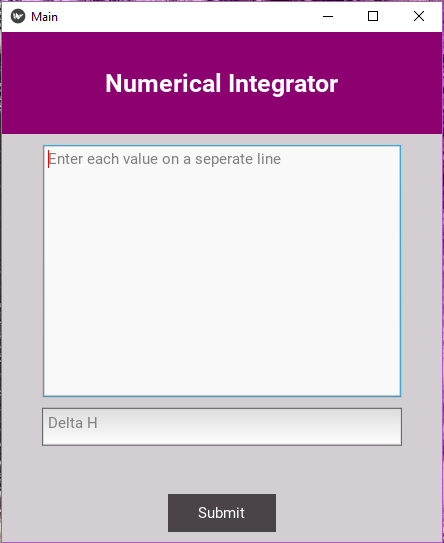
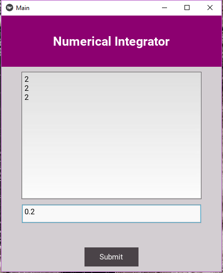

# Numerical Integrator

This a small desktop application which gives us the approximate area under curve formed by points given by the user using Trapezoidal rule and Simpson's rules.

    

#### Steps to run the application on Linux
pip3 install -r requirements.txt \
python3 main.py

#### Steps to run the on Windows
pip install -r requirements.txt \
python main.py

