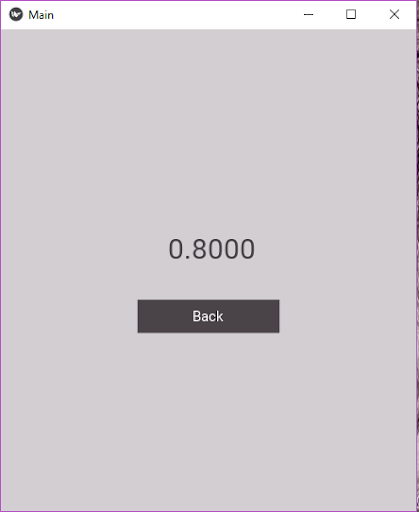

# Numerical Integrator

This a small desktop application which gives us the approximate area under curve formed by points given by the user using Trapezoidal rule and Simpson's rules.

<<<<<<< HEAD

=======
![Image of mainscreen] (https://github.com/ssreeramj/Numerical-Integrator-Kivy/blob/master/images/homepage.png)
![Image of mainscreen2] (https://github.com/ssreeramj/Numerical-Integrator-Kivy/blob/master/images/homepage2.png)
![Image of resultscreen] (https://github.com/ssreeramj/Numerical-Integrator-Kivy/blob/master/images/results.png)
>>>>>>> origin

#### Steps to run the application on Linux
pip3 install -r requirements.txt \
python3 main.py

#### Steps to run the on Windows
pip install -r requirements.txt \
python main.py

